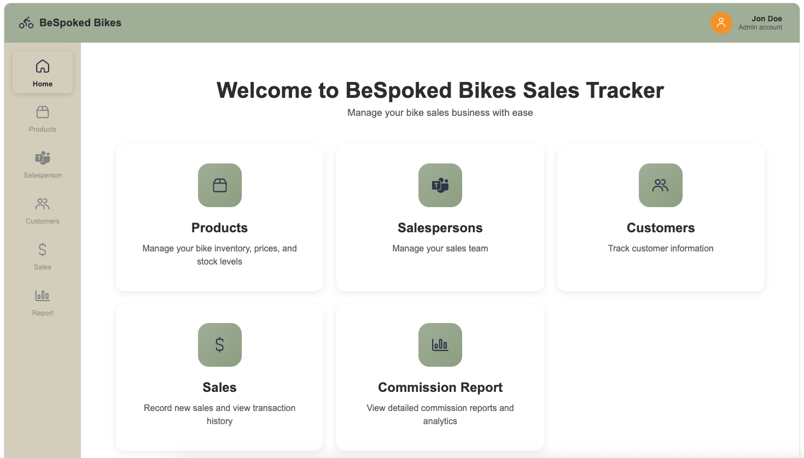

# BeSpoked-Bikes
Sales Tracker Demo

A simple CRUD app meant to simulate running a bike company with sales, customers, inventory, and commission reporting system.

## Screenshot



*Main dashboard showing the sales management interface with navigation sidebar and feature overview cards*

## Local Installation

This is a Node.js project with a React frontend and Express backend. To get started, make sure you have Node.js (v16 or higher) and npm installed on your local device and clone the repository from GitHub to your device.

Navigate to the directory of the repository:

```bash
cd bespoked-bikes
```

### Install Dependencies

**Backend:**
```bash
cd server
npm install
```

**Frontend:**
```bash
cd ../client
npm install
```

### Run the Application

**Terminal 1 - Start the Backend Server:**
```bash
cd server
npm run dev
```
The API server will start on `http://localhost:3002`

**Terminal 2 - Start the Frontend Server:**
```bash
cd client
npm run dev
```
The web application will start on `http://localhost:5173`

Access the application at `http://localhost:5173`

## How does it work?

As straightforward as a modern web app can get: Express routes on the backend serving JSON data via REST API endpoints, with a React frontend consuming that data. The React components manage their own state and make HTTP requests to the backend when needed. All business logic for sales, commission calculations, and inventory management happens on the backend, while the frontend focuses on presentation and user interaction. The backend uses an in-memory data store with sample data to keep things simple and focused on the core functionality.

The app includes:
- **Product Management**: Add/edit bikes, track inventory with visual stock indicators
- **Sales Operations**: Create sales with automatic discount application and inventory reduction
- **Commission Reporting**: Generate quarterly reports with detailed breakdowns
- **Customer & Salesperson Management**: Complete CRUD operations for managing people
- **Real-time Updates**: Live calculations for pricing, commissions, and stock levels 